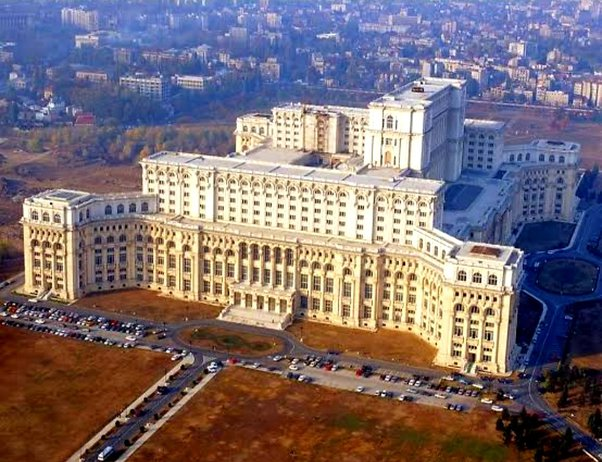
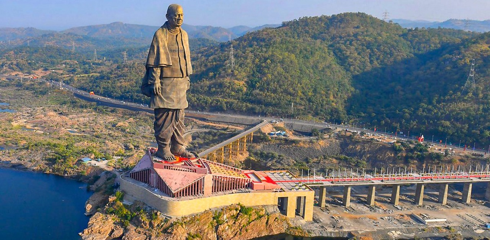
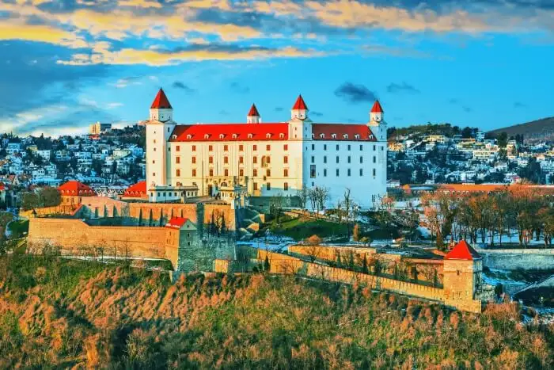
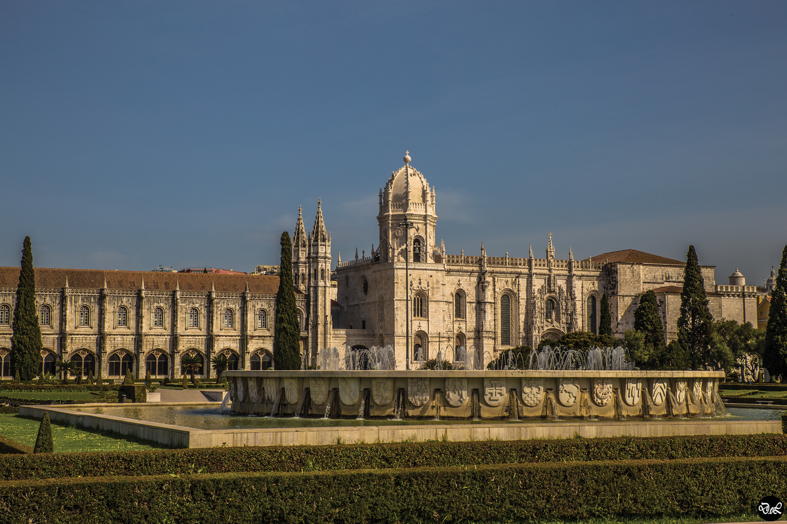
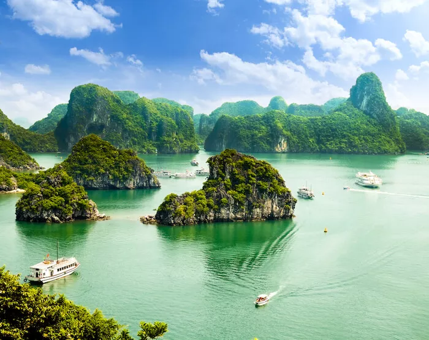
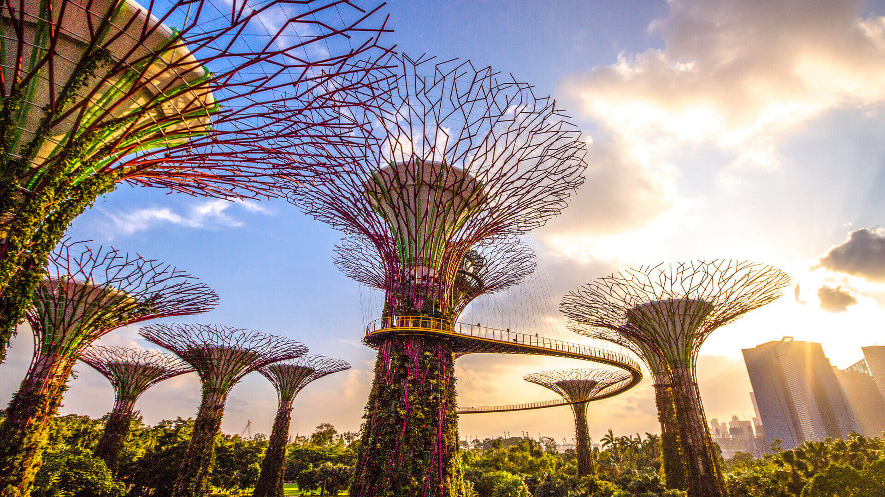

# Around Engagement in one quiz.

Nick Heminsley

---

# England

---

## 1: What is the English Currency?
<!-- GBP -->
---

## 2: What is the Population of England?
<!-- 56 Mil -->
---

## 3: Draw me the English flag
<!--  -->
---

## 4: What is the national dish of England?
<!-- Chicken tikka massalla -->
---

## 5: What is the tallest mountain in England?
<!-- Scafell Pike -->
---

## 6: How do you say hello in English?
<!-- Hello -->
---

# Romania

---

## 1: What is the Romanian currency?
<!-- Leu -->

---

## 2: The second largest delta in Europe lies in Romania. What river is it on?
<!-- Danube-->

---

## 3: Heaviest building in the world?

---

## 4: What is the population of Romania?
<!-- 19.12 million -->

---

## 5: Draw me the Romanian flag
<!-- -->

---

## 6: How do you say hi in Romainian?
<!-- Bună -->
---

# Spain

---

## 1: What was the currency of Spain before it joined the euro in 2002
<!-- Peseta -->
---

## 2: What is the Population of Spain?
<!-- 47 Mil -->

---

## 3: Draw me the Spanish Flag
<!--  -->
---

## 4: Name the following world heritage site.

---

## 5: What is the national dish of Spain?
<!-- Paella -->

---

## 6: How do you say hi in Spanish?
<!-- Hola -->

---

# India

---

## 1: What is the currency of India?
<!-- Rupee -->
---

## 2: What is the Population of India?
<!-- 1.408 billion -->

---

## 3: Draw me the Indian Flag
<!--  -->
---

## 4: How many seasons does the Hindu calendar have?
<!-- 6 -->

---

## 5: The world's tallest statue is in India, what is it called?

<!-- Statue of Unity -->

---

## 6: How do you say hi in Hindi?
<!-- namaste -->

---

# Slovakia

---

## 1: What was the currency of Slovakia before it swapped to the Euro in 2009?
<!-- Koruna -->

---

## 2: What is the Population of Slovakia
<!-- 5.5 million -->

---

## 3: Draw me the Slovakian Flag
<!--  -->
---

## 4: Name the following landmark

<!-- Bratislava Castle -->

---

## 5: How many countries border Slovakia
<!-- 5 -->

---

## 6: How do you say hi in Slovak?
<!-- Ahoj -->

---

# Portugal 

---

## 1: What was the currency of Portugal before it swapped to the Euro in 2002
<!-- Escudo -->

---

## 2: What is the Population of Portugal
<!-- 10.33 million  -->

---

## 3: Draw me the Portuguese Flag
<!--  -->
---

## 4: What is the national drink of Portugal 
<!-- Licor Beirão -->

---

## 5: Name the following landmark

<!-- Jerónimos Monastery -->

---

## 6: How do you say hi in Portuguese?
<!-- oi -->

---

# Scotland 

---

## 1: What was the currency of Scotland before 1707
<!-- Pound Scots -->

---

## 2: What is the Population of Scotland
<!-- 5.454 million  -->

---

## 3: Draw me the Scottish Flag
<!--  -->
---

## 4: What is the official animal of Scotland
<!-- Unicorn -->

---

## 5: What Scottish food is banned from being exported to the US since 1971
<!-- Haggis -->

---

## 6: How do you say hello in Scottish Gaelic?
<!-- Halò -->

---

# Vietnam 

---

## 1: What is the currency of Vietnam
<!-- Dong -->

---

## 2: What is the Population of Vietnam
<!-- 97.47 million  -->

---

## 3: Draw me the Vietnamese Flag
<!--  -->
---

## 4: Name the attraction

<!-- Ha Long bay -->

---

## 5: Vietnam is the world's largest exporter of which type of nuts (55%)?
<!-- Cashew -->

---

## 6: How do you say hi in Vietnamese?
<!-- CHÀO -->

---

# Turkey 

---

## 1: What is the currency of Turkey
<!-- Lira -->

---

## 2: What is the Population of Turkey
<!-- 84.78 million  -->

---

## 3: Draw me the Turkish Flag
<!--  -->
---

## 4: Which city in Turkey is the only city in the world to straddle two continents?

<!-- Istanbul -->

---

## 5: What is the traditional sport of Turkey?
<!-- Oil wrestling -->

---

## 6: How do you say hi in Turkish?
<!-- MERHABA -->

---

# Singapore 

---

## 1: What is the currency of Singapore?
<!-- Singapore Dollar -->

---

## 2: What is the Population of Singapore?
<!-- 5.454 million  -->

---

## 3: Draw me the Singapore Flag
<!--  -->

---

## 4: Name the attraction that also hosts the worlds largest greenhouse.

---

## 5: The name "Singapore" is derived from Sanskrit. What is the meaning?
<!-- Lion city -->

---

## 6: How do you say hi in Malay?
<!-- hai -->

---

# Pointless

1) Countries That End With E.
2) Countries where Portuguese is an offical language.
3) Countries that drive on the Left hand side.
4) Name a country that matches all 3