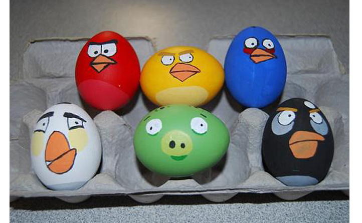
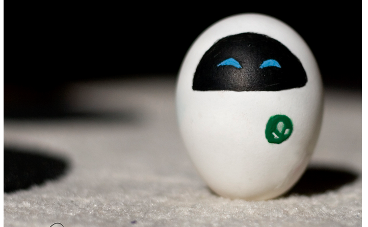
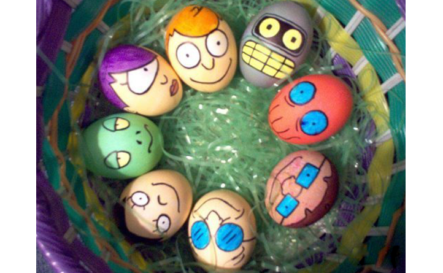
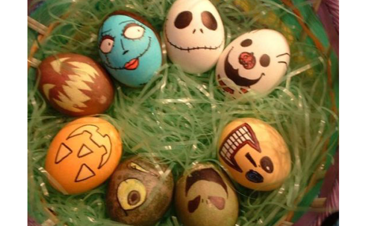
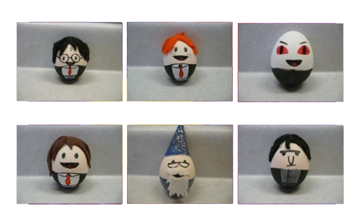
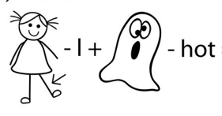
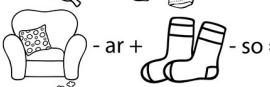
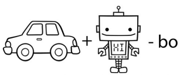
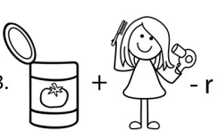
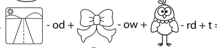

# A quiz about easter

Nick Heminsley

---

# An eggcelent question

---

## 1: Which electronic plaything takes its name from the Japanese for "Loveable Egg"?

<!-- tamagotchi -->
---

## 2: "I am the egg man" is a line from which song by The Beatles?

<!-- I am the walrus -->
---

## 3: The largest bird eggs, are from  what birds?
<!-- Ostriches. -->
---

## 4: How long to fully hard boil an egg
<!-- 8-12mins -->

---

## 5: What is the tradition behind the hot cross bun
<!-- The cross on which jesus died -->

---

# Egg-cellent words

Eggs who arnt living anymore? Eggs-tinct

---

## 1: Very precise eggs
<!-- eggs-axt -->

---

## 2: Eggs doing stuff like running and playing sports
<!-- eggs-ercise -->

---

## 3: Mysterious eggs from a faraway land
<!-- eggs-otic-->

---

## 4: Eggs who no longer live in the country they were laid in.
<!-- eggs-pat -->

---

## 5: Eggs who know everything
<!-- eggs-pert-->

---

# Whats represented by that egg

---

## 1

---

## 2

---

## 3

---

## 4

---

## 5

---

# Finish the yolk

---

## 1: Detective: 'I've spent hours interrogating the egg. ...'

<!-- its about to crack. -->

---

## 2: I bought some really oddly shaped eggs today, and now I can't find them.

<!-- they've been misslaid. -->

---

## 3: I steal all my eggs from the farm down the road.

<!-- I like them poached -->

---

## 4: I saw the world's largest egg today.

<!-- That'll take some beating -->

---

## 5: How did the egg get up the mountain

<!-- It scrambled up -->

---

# Another round of questions

---

## 1

---

## 2

---

## 3

---

## 4

---

## 5

---

# A ChatGPT generated round

---

What do Christians celebrate on Easter Sunday?
a. The birth of Jesus
b. The resurrection of Jesus
c. The ascension of Jesus
d. The crucifixion of Jesus

---

What is the name of the traditional Easter bread eaten in Italy?
a. Hot Cross Buns
b. Simnel Cake
c. Colomba Pasquale
d. Easter Panettone

---

What animal is often associated with Easter?
a. Rabbit
b. Dog
c. Cat
d. Fish

---

What is the name of the traditional Easter egg game played in many countries?
a. Egg toss
b. Egg hunt
c. Egg roll
d. Egg cricket

---

What is the name of the Holy Week procession in Spain that involves hooded figures?
a. La Tomatina
b. La Feria
c. La Semana Santa
d. La Fiesta de San Fermin

---

What flower is often associated with Easter?
a. Daffodil
b. Rose
c. Lily
d. Sunflower

---

In what country do children dress up as witches and go door-to-door asking for candy on Easter Sunday?
a. Sweden
b. Norway
c. Denmark
d. Finland

---

In what year did the White House start holding an annual Easter egg roll?
a. 1878
b. 1905
c. 1929
d. 1942

---

What is the name of the spring festival celebrated by Hindus that coincides with Easter?
a. Holi
b. Diwali
c. Navratri
d. Dussehra

---

What color is traditionally associated with Easter?
a. Red
b. Yellow
c. Green
d. Purple

---

# Pointless

- Name a way you can cook an egg
- Name a brand of chocolate
- Name an egg laying animal
